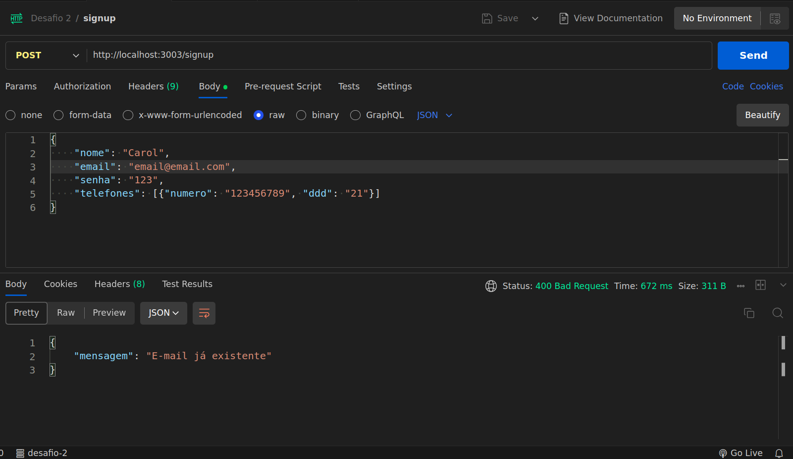

# Backend - Desafio Técnico 2
Este projeto consiste no desenvolvimento de uma API RESTful para autenticação de usuários, permitindo operações de cadastro, autenticação e recuperação de informações do usuário. A linguagem escolhida para implementação é JavaScript.

### Objetivo
Desenvolver uma API que atenda às necessidades de autenticação de usuários, seguindo padrões RESTful. As principais funcionalidades incluem:

- Cadastro (Sign Up): Permitir o registro de novos usuários com informações como nome, e-mail, senha e detalhes do telefone.
- Autenticação (Sign In): Possibilitar que usuários autentiquem-se utilizando e-mail e senha.
- Busca de Usuário: Permitir a recuperação de informações do usuário autenticado.


### Especificações Técnicas
1. Formato de Comunicação:
Todos os endpoints aceitam e retornam dados no formato JSON.

2. Persistência de Dados:
Armazenamento persistente dos dados do usuário utilizando banco de dados SQLite.

### Como rodar este projeto
1. Clone este repositório:
   ```bash
     git clone https://github.com/carolcampos22/desafio-tecnico-2.git
   ```
2. Entre na pasta:
   ```bash
     cd desafio-tecnico-2
   ```
3. Crie um arquivo .env na raiz do projeto para armazenar variáveis de ambiente, como chaves secretas ou configurações específicas, confome exemplificado no arquivo .env.example.

4. Execute o projeto:
   ```bash
    npm start

   ```
5. Use ferramentas como Postman ou curl para testar os endpoints conforme descrito na seção "Endpoints"

### Endpoints

1.  Sign Up (Criação de Cadastro) (/signup)

Exemplo de requisição:


2. Sign In (Autenticação) (/signin)

Exemplo de requisição:


3. Buscar Usuário (/profile)

Exemplo de requisição:

